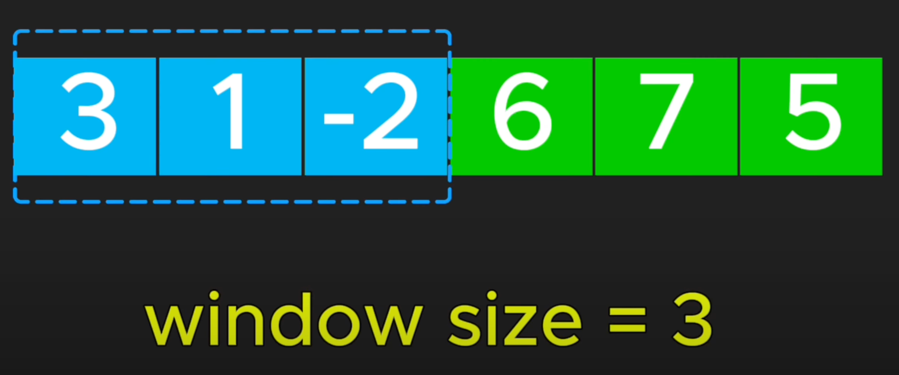
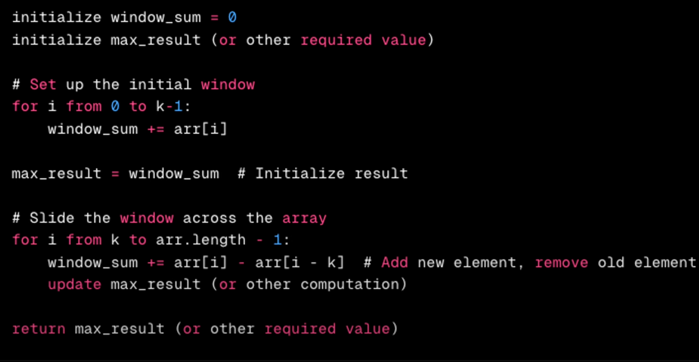
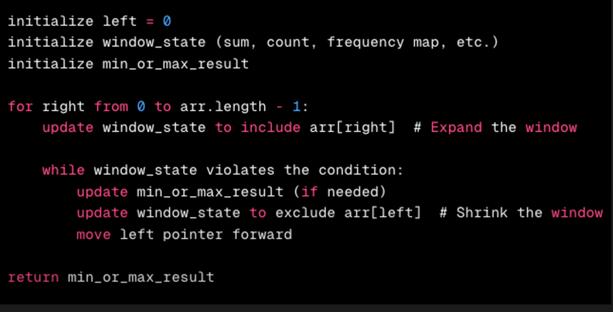

####

## Sliding Window

Example

## Application

1. Array
2. Linked List
3. Strings

## Types of Sliding Windows

1. Fixed Sliding Window
2. Dynamic Sliding window

### Fixed Sliding window

It maintain constant length window (if indow size is given)

- Eg: Subarray, Substring of a fixed length

#### Generic Template:

### Dynamic Window:

Unlike fixed it expands the length based on conditions.
Applied to problems where window size is not fixed

#### Generic Template

- Eg: Longest Subarray, Short Subarray
