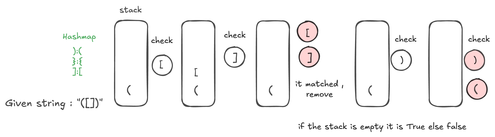

##

The Valid Parentheses problem is a common coding problem that tests a candidate's ability to use stacks or data structures efficiently.

## Problem Statement

Given a string containing just the characters '(', ')', '{', '}', '[', and ']', determine if the input string is valid. A string is valid if:

Open brackets ((, {, [) must be closed by the same type of bracket (), }, ]).
Open brackets must be closed in the correct order.
Every closing bracket has a corresponding open bracket of the same type.

## Examples

### ✅ Valid Cases:

```bash
"()" → Valid
"()[]{}" → Valid
"{[()]}" → Valid
```

### ❌ Invalid Cases:

```bash

"(]" → Invalid (Mismatched brackets)
"([)]" → Invalid (Wrong order)
"({}" → Invalid (Unmatched brackets)

```

## Solution


